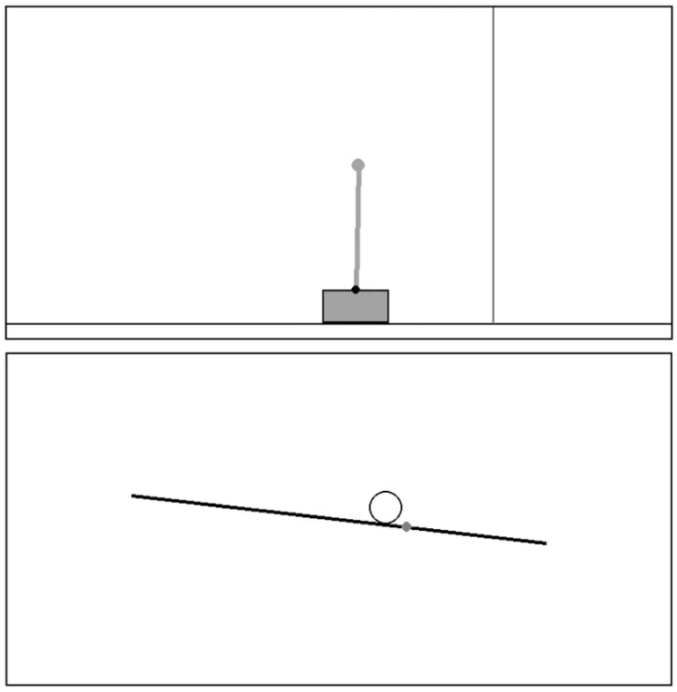

# DRL for Continuous System Control

> Project developed for the implementation of machine learning techniques, utilizing *Deep Reinforcement Learning* (DRL) algorithms for the control of continuous systems.

The repository includes the development of computational implementations for analyzing the use of machine learning techniques in the control of continuous systems. In this work, agents were trained using the *Deep Q-Network* (DQN) and *Proximal Policy Optimization* (PPO) algorithms, with the aim of learning control policies for the *Ball and Beam* and *Cart-Pendulum* systems.

# About Environments

These systems were implemented using the [Pygame](https://www.pygame.org/docs/) library. This choice enables greater control over the modeling, including the modification of physical parameters for each system, specific simulation conditions, and control strategies, thereby allowing for specific analyses and comparisons between the algorithms under investigation and the results already available in the literature for existing environments.

Below, both systems are implemented.

  

